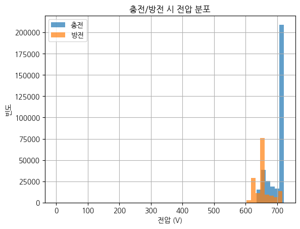
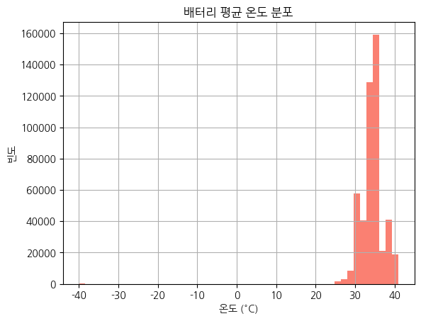
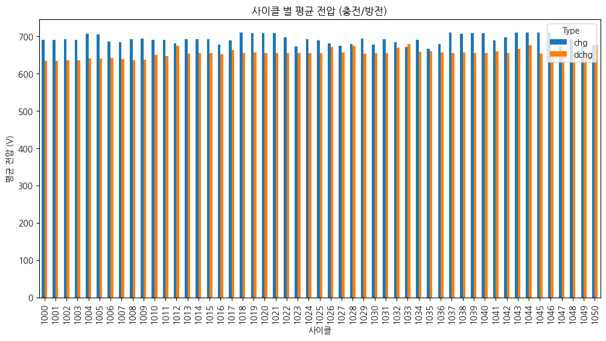
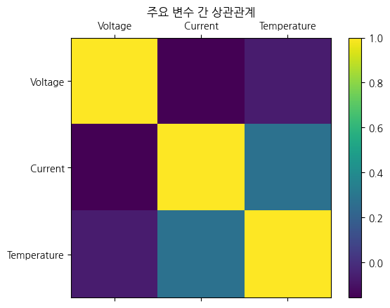

# 배터리 충방전 데이터 EDA 보고서

_이 보고서는 `data/raw_data/train` 폴더의 모든 CSV 파일을 통합하여 생성되었습니다._
## 1. 데이터 개요
### 데이터 샘플 (상위 5개)
```
             DateTime  Voltage  Current  Temperature Cycle Type
0 2020-08-04 15:51:49    641.3      0.0         31.0  1000  chg
1 2020-08-04 15:51:50    641.3      0.0         31.0  1000  chg
2 2020-08-04 15:51:51    641.3      0.0         31.0  1000  chg
3 2020-08-04 15:51:52    641.3      0.0         31.0  1000  chg
4 2020-08-04 15:51:53    641.3      0.0         31.0  1000  chg
```

### 데이터 정보
```
<class 'pandas.core.frame.DataFrame'>
RangeIndex: 482639 entries, 0 to 482638
Data columns (total 6 columns):
 #   Column       Non-Null Count   Dtype         
---  ------       --------------   -----         
 0   DateTime     480948 non-null  datetime64[ns]
 1   Voltage      480949 non-null  float64       
 2   Current      480948 non-null  float64       
 3   Temperature  480948 non-null  float64       
 4   Cycle        482639 non-null  object        
 5   Type         482639 non-null  object        
dtypes: datetime64[ns](1), float64(3), object(2)
memory usage: 22.1+ MB

```

### 기술 통계
```
                            DateTime        Voltage        Current    Temperature
count                         480948  480949.000000  480948.000000  480948.000000
mean   2020-10-29 13:28:50.836844544     683.012654      -2.134577      34.317278
min              2020-08-04 15:51:49       0.000000    -121.500000     -40.000000
25%    2020-08-20 08:58:39.750000128     650.800000     -41.300000      33.000000
50%       2020-09-24 10:46:53.500000     694.800000       0.000000      34.000000
75%    2021-01-12 14:01:34.249999872     712.900000       0.000000      36.000000
max              2021-03-03 13:09:49     721.500000     137.200000      41.000000
std                              NaN      34.559459      45.771913       3.008360
```

### 결측치 확인
```
DateTime       1691
Voltage        1690
Current        1691
Temperature    1691
Cycle             0
Type              0
```

## 2. 데이터 시각화

### 2.1. 충전/방전 데이터 분포
전체 데이터에서 충전과 방전 데이터의 비율을 보여줍니다.


#### 교차표
```
       count
Type        
chg   325834
dchg  156805
```

### 2.2. 전압 분포
충전과 방전 시의 전압 분포를 비교합니다. 충전 시 높은 전압 대역에, 방전 시 낮은 전압 대역에 데이터가 분포하는 경향을 보입니다.


### 2.3. 전류 분포
충전 전류는 양수 값을, 방전 전류는 음수 값을 가집니다. 각 과정에서 특정 전류 값에 데이터가 집중된 것을 볼 수 있습니다.


### 2.4. 온도 분포
측정된 배터리의 평균 온도(Tavg) 분포를 보여줍니다.


### 2.5. 특정 사이클(1000)의 시계열 데이터
첫 번째 사이클(1000)의 시간에 따른 전압, 전류, 온도의 변화를 보여줍니다. 충/방전 과정의 변화 패턴을 확인할 수 있습니다.


### 2.6. 사이클 별 평균 전압
각 사이클의 충전, 방전 과정에서의 평균 전압을 막대 그래프로 비교합니다.


#### 피벗 테이블
```
Type          chg        dchg
Cycle                        
1000   690.951207  634.019392
1001   690.595157  633.925014
1002   691.571621  635.916758
1003   690.729877  635.885110
1004   706.371944  640.303670
```

### 2.7. 사이클 별 평균 온도
사이클이 진행됨에 따른 평균 온도의 변화 추이를 보여줍니다.


### 2.8. 전압-전류 관계
전압과 전류의 관계를 산점도를 통해 확인합니다. 충전/방전 시 특정 구간에 점들이 밀집되어 있습니다.


### 2.9. 온도-전압 관계
온도와 전압의 관계를 산점도를 통해 확인합니다.


### 2.10. 주요 변수 간 상관관계 히트맵
주요 수치형 변수인 전압, 전류, 온도 간의 상관관계를 히트맵으로 시각화합니다. 전류와 전압 사이에 약간의 음의 상관관계가 보입니다.


#### 상관계수 행렬
```
              Voltage   Current  Temperature
Voltage      1.000000 -0.156908    -0.069644
Current     -0.156908  1.000000     0.274998
Temperature -0.069644  0.274998     1.000000
```