# Online Retail 데이터 탐색적 데이터 분석(EDA) 보고서

## 1. 데이터 기본 정보

### 데이터 샘플 (상위 5개)
|    |   InvoiceNo | StockCode   | Description                         |   Quantity | InvoiceDate         |   UnitPrice |   CustomerID | Country        |   TotalPrice |
|---:|------------:|:------------|:------------------------------------|-----------:|:--------------------|------------:|-------------:|:---------------|-------------:|
|  0 |      536365 | 85123A      | WHITE HANGING HEART T-LIGHT HOLDER  |          6 | 2010-12-01 08:26:00 |        2.55 |        17850 | United Kingdom |        15.3  |
|  1 |      536365 | 71053       | WHITE METAL LANTERN                 |          6 | 2010-12-01 08:26:00 |        3.39 |        17850 | United Kingdom |        20.34 |
|  2 |      536365 | 84406B      | CREAM CUPID HEARTS COAT HANGER      |          8 | 2010-12-01 08:26:00 |        2.75 |        17850 | United Kingdom |        22    |
|  3 |      536365 | 84029G      | KNITTED UNION FLAG HOT WATER BOTTLE |          6 | 2010-12-01 08:26:00 |        3.39 |        17850 | United Kingdom |        20.34 |
|  4 |      536365 | 84029E      | RED WOOLLY HOTTIE WHITE HEART.      |          6 | 2010-12-01 08:26:00 |        3.39 |        17850 | United Kingdom |        20.34 |

### 데이터 정보
```
<class 'pandas.core.frame.DataFrame'>
Index: 397884 entries, 0 to 541908
Data columns (total 9 columns):
 #   Column       Non-Null Count   Dtype         
---  ------       --------------   -----         
 0   InvoiceNo    397884 non-null  object        
 1   StockCode    397884 non-null  object        
 2   Description  397884 non-null  object        
 3   Quantity     397884 non-null  int64         
 4   InvoiceDate  397884 non-null  datetime64[ns]
 5   UnitPrice    397884 non-null  float64       
 6   CustomerID   397884 non-null  int64         
 7   Country      397884 non-null  object        
 8   TotalPrice   397884 non-null  float64       
dtypes: datetime64[ns](1), float64(2), int64(2), object(4)
memory usage: 30.4+ MB

```

### 기술 통계량
|       |    Quantity | InvoiceDate                   |    UnitPrice |   CustomerID |   TotalPrice |
|:------|------------:|:------------------------------|-------------:|-------------:|-------------:|
| count | 397884      | 397884                        | 397884       |    397884    |   397884     |
| mean  |     12.9882 | 2011-07-10 23:41:23.511023360 |      3.11649 |     15294.4  |       22.397 |
| min   |      1      | 2010-12-01 08:26:00           |      0.001   |     12346    |        0.001 |
| 25%   |      2      | 2011-04-07 11:12:00           |      1.25    |     13969    |        4.68  |
| 50%   |      6      | 2011-07-31 14:39:00           |      1.95    |     15159    |       11.8   |
| 75%   |     12      | 2011-10-20 14:33:00           |      3.75    |     16795    |       19.8   |
| max   |  80995      | 2011-12-09 12:50:00           |   8142.75    |     18287    |   168470     |
| std   |    179.332  | nan                           |     22.0979  |      1713.14 |      309.071 |


## 2. 데이터 시각화 및 분석

### 상위 10개 국가별 주문 수
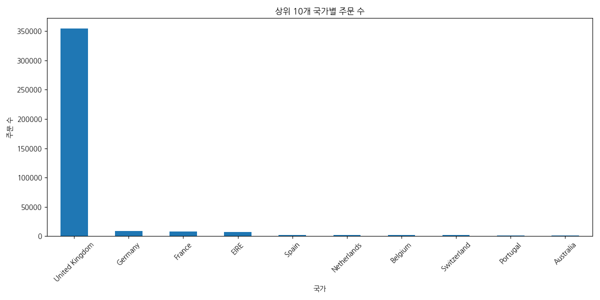
영국(United Kingdom)이 압도적으로 많은 주문 수를 차지합니다.


### 상위 10개 국가별 주문 수 표
|    | Country        |   count |
|---:|:---------------|--------:|
|  0 | United Kingdom |  354321 |
|  1 | Germany        |    9040 |
|  2 | France         |    8341 |
|  3 | EIRE           |    7236 |
|  4 | Spain          |    2484 |
|  5 | Netherlands    |    2359 |
|  6 | Belgium        |    2031 |
|  7 | Switzerland    |    1841 |
|  8 | Portugal       |    1462 |
|  9 | Australia      |    1182 |


### 월별 총 매출 추이
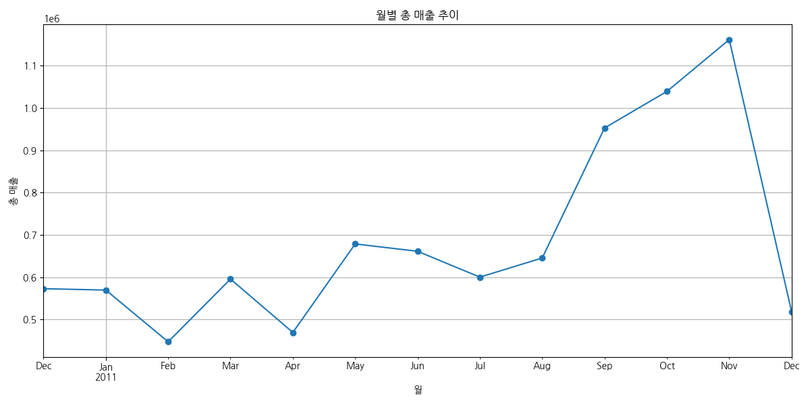
2011년 하반기로 갈수록 매출이 증가하는 추세를 보이며, 특히 11월에 최고치를 기록합니다.


### 월별 총 매출 표
|    | InvoiceDate         |       TotalPrice |
|---:|:--------------------|-----------------:|
|  0 | 2010-12-31 00:00:00 | 572714           |
|  1 | 2011-01-31 00:00:00 | 569445           |
|  2 | 2011-02-28 00:00:00 | 447137           |
|  3 | 2011-03-31 00:00:00 | 595501           |
|  4 | 2011-04-30 00:00:00 | 469200           |
|  5 | 2011-05-31 00:00:00 | 678595           |
|  6 | 2011-06-30 00:00:00 | 661214           |
|  7 | 2011-07-31 00:00:00 | 600091           |
|  8 | 2011-08-31 00:00:00 | 645344           |
|  9 | 2011-09-30 00:00:00 | 952838           |
| 10 | 2011-10-31 00:00:00 |      1.03932e+06 |
| 11 | 2011-11-30 00:00:00 |      1.16182e+06 |
| 12 | 2011-12-31 00:00:00 | 518193           |


### 시간대별 주문 수
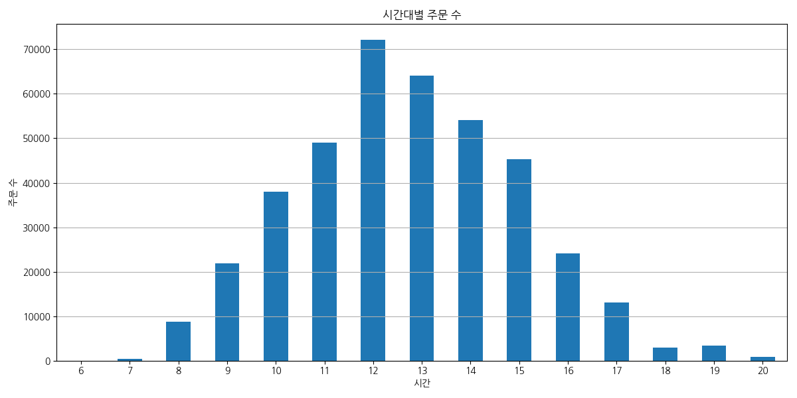
주로 점심 시간대인 12시부터 15시 사이에 주문이 가장 많습니다.


### 시간대별 주문 수 표
|    |   InvoiceDate |   count |
|---:|--------------:|--------:|
|  0 |             6 |       1 |
|  1 |             7 |     379 |
|  2 |             8 |    8690 |
|  3 |             9 |   21944 |
|  4 |            10 |   37997 |
|  5 |            11 |   49084 |
|  6 |            12 |   72065 |
|  7 |            13 |   64026 |
|  8 |            14 |   54118 |
|  9 |            15 |   45369 |
| 10 |            16 |   24089 |
| 11 |            17 |   13071 |
| 12 |            18 |    2928 |
| 13 |            19 |    3321 |
| 14 |            20 |     802 |


### 요일별 주문 수
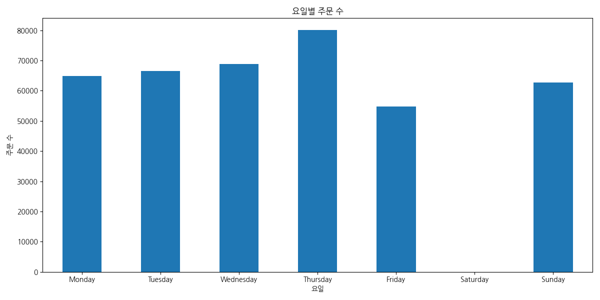
주중(월-금)에 주문이 집중되어 있으며, 토요일은 거래가 없습니다. 일요일 거래는 매우 적습니다.


### 요일별 주문 수 표
|    | DayOfWeek   |   count |
|---:|:------------|--------:|
|  0 | Monday      |   64893 |
|  1 | Tuesday     |   66473 |
|  2 | Wednesday   |   68885 |
|  3 | Thursday    |   80035 |
|  4 | Friday      |   54825 |
|  5 | Saturday    |       0 |
|  6 | Sunday      |   62773 |


### 상위 10개 판매 상품 (수량 기준)
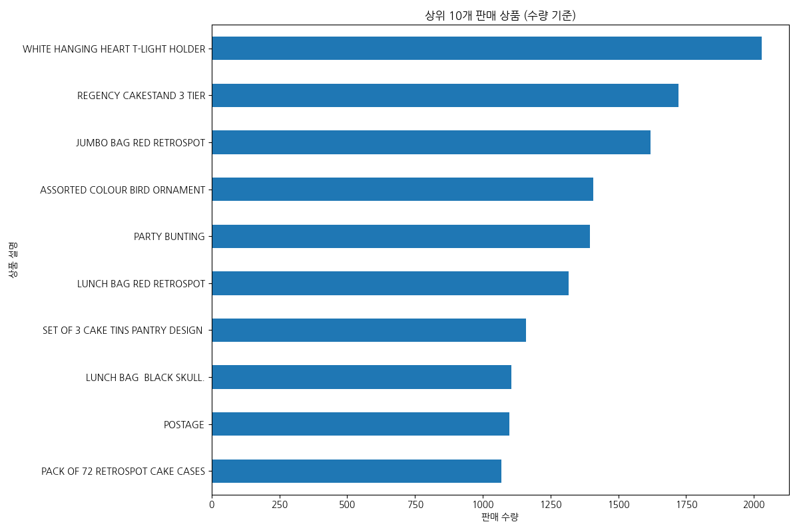
'WHITE HANGING HEART T-LIGHT HOLDER'가 가장 많이 판매된 상품입니다.


### 상위 10개 판매 상품 표
|    | Description                        |   count |
|---:|:-----------------------------------|--------:|
|  0 | WHITE HANGING HEART T-LIGHT HOLDER |    2028 |
|  1 | REGENCY CAKESTAND 3 TIER           |    1723 |
|  2 | JUMBO BAG RED RETROSPOT            |    1618 |
|  3 | ASSORTED COLOUR BIRD ORNAMENT      |    1408 |
|  4 | PARTY BUNTING                      |    1396 |
|  5 | LUNCH BAG RED RETROSPOT            |    1316 |
|  6 | SET OF 3 CAKE TINS PANTRY DESIGN   |    1159 |
|  7 | LUNCH BAG  BLACK SKULL.            |    1105 |
|  8 | POSTAGE                            |    1099 |
|  9 | PACK OF 72 RETROSPOT CAKE CASES    |    1068 |


### 상위 10개 매출 상품 (금액 기준)
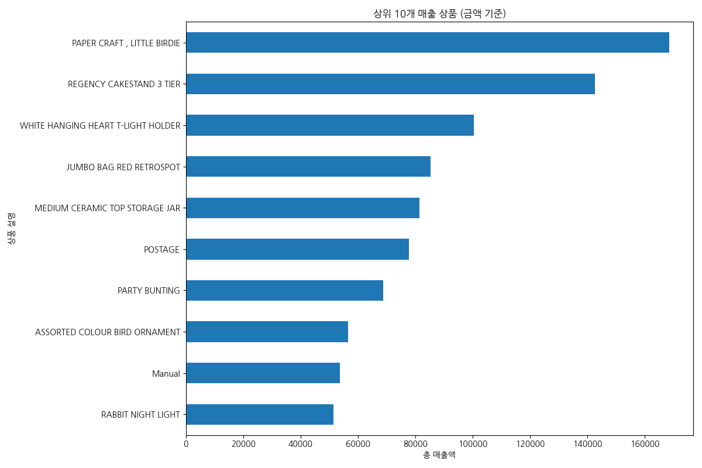
'DOTCOM POSTAGE'와 'REGENCY CAKESTAND 3 TIER'가 매출액 기준으로 최상위 상품입니다.


### 상위 10개 매출 상품 표
|    | Description                        |   TotalPrice |
|---:|:-----------------------------------|-------------:|
|  0 | PAPER CRAFT , LITTLE BIRDIE        |     168470   |
|  1 | REGENCY CAKESTAND 3 TIER           |     142593   |
|  2 | WHITE HANGING HEART T-LIGHT HOLDER |     100448   |
|  3 | JUMBO BAG RED RETROSPOT            |      85220.8 |
|  4 | MEDIUM CERAMIC TOP STORAGE JAR     |      81416.7 |
|  5 | POSTAGE                            |      77804   |
|  6 | PARTY BUNTING                      |      68844.3 |
|  7 | ASSORTED COLOUR BIRD ORNAMENT      |      56580.3 |
|  8 | Manual                             |      53779.9 |
|  9 | RABBIT NIGHT LIGHT                 |      51346.2 |


### 단가와 수량의 관계
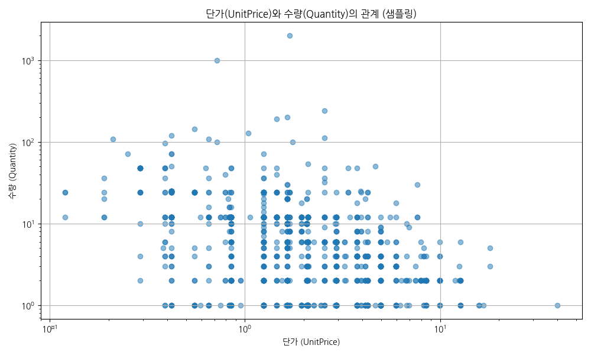
단가가 낮을수록 수량이 많은 경향이 있으나, 전반적으로 약한 음의 상관관계를 보입니다. (로그 스케일 적용)


### 고객별 총 구매액 분포
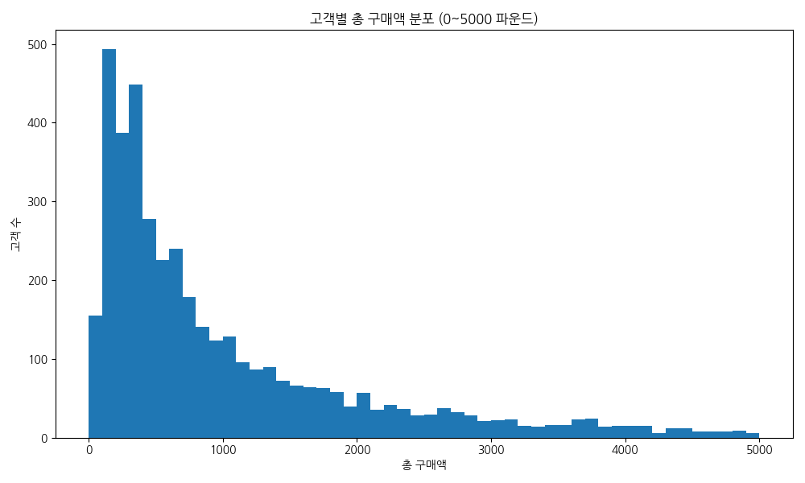
대부분의 고객이 소액을 지출하며, 고액을 지출하는 고객은 소수입니다. 롱테일 분포를 보입니다.


### 고객별 주문 빈도 분포
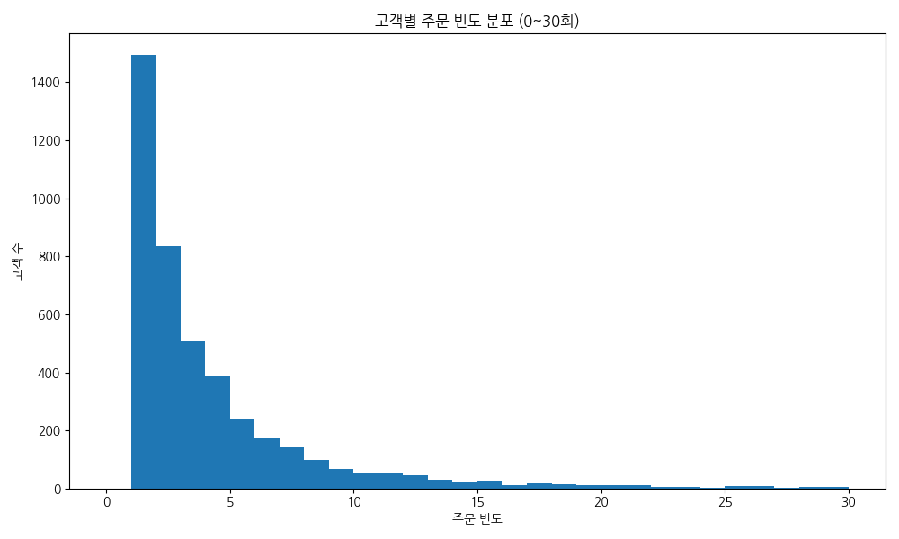
대부분의 고객은 1~2회 주문하며, 재구매 고객은 상대적으로 적습니다.


### RFM 기반 고객 세그먼트 분포
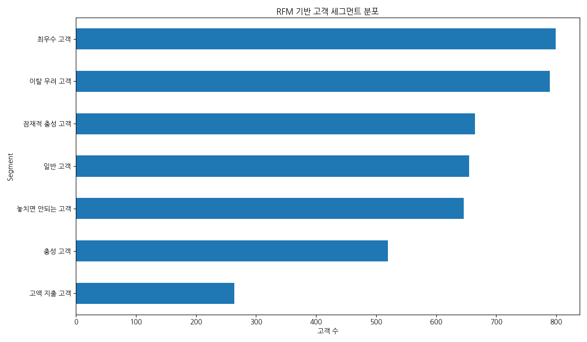
고객을 RFM 기법으로 세분화하여 각 그룹의 비중을 확인했습니다. '일반 고객'과 '이탈 우려 고객'이 가장 큰 비중을 차지합니다.


### RFM 고객 세그먼트 표
|    | Segment            |   count |
|---:|:-------------------|--------:|
|  0 | 최우수 고객        |     799 |
|  1 | 이탈 우려 고객     |     789 |
|  2 | 잠재적 충성 고객   |     665 |
|  3 | 일반 고객          |     655 |
|  4 | 놓치면 안되는 고객 |     646 |
|  5 | 충성 고객          |     520 |
|  6 | 고액 지출 고객     |     264 |


## 3. 월별 ARPU(사용자당 평균 매출) 분석

### 월별 ARPU 선 그래프
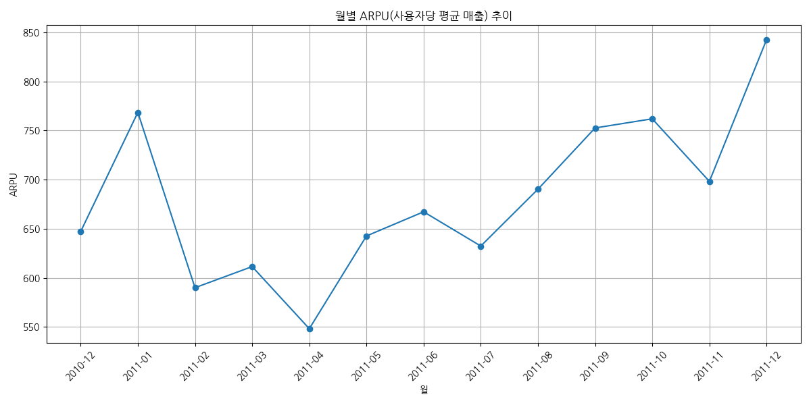
월별 사용자당 평균 매출(ARPU)은 연말에 가까워질수록 증가하는 경향을 보입니다. 이는 연말 쇼핑 시즌의 영향으로 분석됩니다.


### 월별 ARPU 막대 그래프
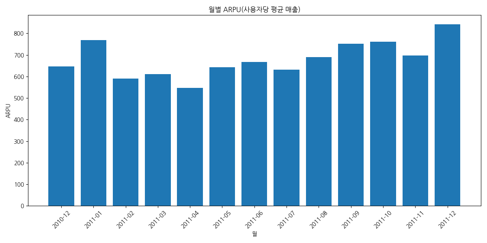
막대 그래프는 각 월의 ARPU를 직관적으로 비교할 수 있게 해줍니다.


### 월별 ARPU 데이터
월별 총매출, 구매 고객 수, 그리고 계산된 ARPU 값을 표로 나타냈습니다.
| 월      |           총매출 |   구매고객수 |    ARPU |
|:--------|-----------------:|-------------:|--------:|
| 2010-12 | 572714           |          885 | 647.134 |
| 2011-01 | 569445           |          741 | 768.482 |
| 2011-02 | 447137           |          758 | 589.891 |
| 2011-03 | 595501           |          974 | 611.397 |
| 2011-04 | 469200           |          856 | 548.131 |
| 2011-05 | 678595           |         1056 | 642.608 |
| 2011-06 | 661214           |          991 | 667.219 |
| 2011-07 | 600091           |          949 | 632.34  |
| 2011-08 | 645344           |          935 | 690.207 |
| 2011-09 | 952838           |         1266 | 752.637 |
| 2011-10 |      1.03932e+06 |         1364 | 761.964 |
| 2011-11 |      1.16182e+06 |         1664 | 698.208 |
| 2011-12 | 518193           |          615 | 842.59  |

## DAU, MAU 구하고 막대그래프 시각화 하고 교차표도 함께 출력할 것 
## 시간-요일 교차표 구하고 히트맵으로 시각화 하고 교차표도 함께 출력할 것 
## 월단위 구매 고객 수 리텐션 구하고 히트맵으로 시각화 하고 교차표도 함께 출력할 것 
## 리텐션 결과에서 첫달 코호트를 Acquisition으로 구할 것