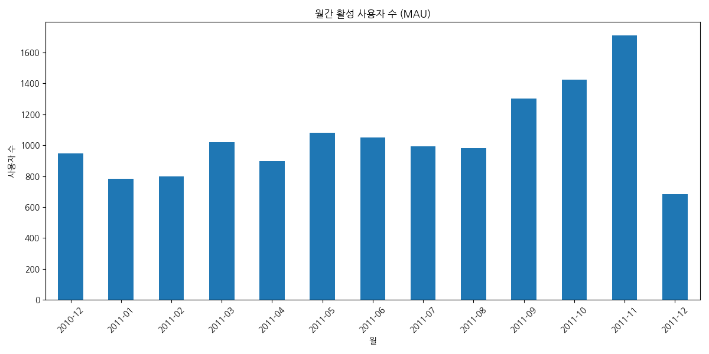
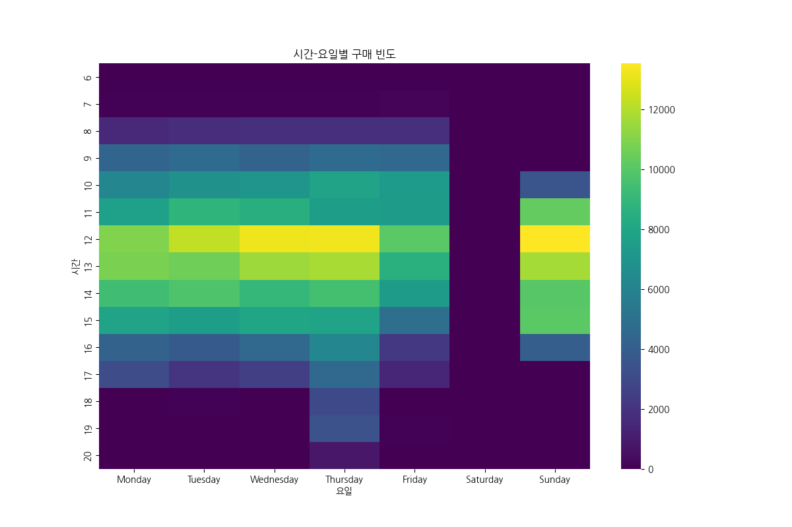
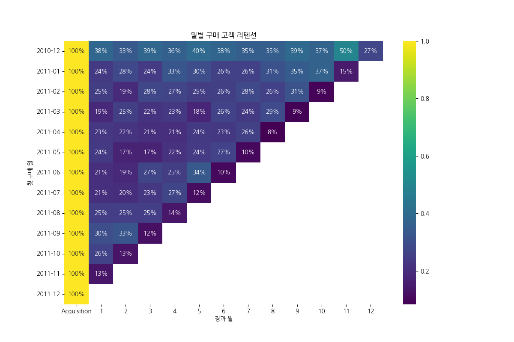

# Retention Analysis 보고서
분석 일자: 2025-12-11

## 1. MAU (월간 활성 사용자 수)

### MAU 교차표

| YearMonth   |   사용자 수 |
|:------------|------------:|
| 2010-12     |         948 |
| 2011-01     |         783 |
| 2011-02     |         798 |
| 2011-03     |        1020 |
| 2011-04     |         899 |
| 2011-05     |        1079 |
| 2011-06     |        1051 |
| 2011-07     |         993 |
| 2011-08     |         980 |
| 2011-09     |        1302 |
| 2011-10     |        1425 |
| 2011-11     |        1711 |
| 2011-12     |         686 |

## 2. 시간-요일별 구매 빈도

### 시간-요일 교차표

|   Hour |   Monday |   Tuesday |   Wednesday |   Thursday |   Friday |   Saturday |   Sunday |
|-------:|---------:|----------:|------------:|-----------:|---------:|-----------:|---------:|
|      6 |        0 |         0 |           0 |         41 |        0 |          0 |        0 |
|      7 |       61 |        65 |          59 |         64 |      134 |          0 |        0 |
|      8 |     1575 |      1740 |        1825 |       1804 |     1848 |          0 |        0 |
|      9 |     4381 |      4658 |        4207 |       4676 |     4512 |          0 |       30 |
|     10 |     6245 |      6810 |        7076 |       7853 |     7369 |          0 |     3598 |
|     11 |     7663 |      8822 |        8547 |       7500 |     7433 |          0 |    10284 |
|     12 |    10978 |     12262 |       13196 |      13275 |    10081 |          0 |    13550 |
|     13 |    10848 |     10552 |       11541 |      11770 |     8625 |          0 |    11726 |
|     14 |     9378 |      9771 |        9023 |       9512 |     7433 |          0 |     9958 |
|     15 |     7875 |      7470 |        8034 |       7858 |     4884 |          0 |    10099 |
|     16 |     4250 |      3775 |        4530 |       6228 |     2222 |          0 |     3992 |
|     17 |     3093 |      2109 |        2528 |       4526 |     1478 |          0 |        0 |
|     18 |       35 |        76 |           0 |       3015 |       11 |          0 |        0 |
|     19 |        0 |         0 |          15 |       3407 |       89 |          0 |        0 |
|     20 |        0 |         0 |          18 |        845 |        8 |          0 |        0 |

## 3. 월별 구매 고객 리텐션 (Acquisition 기반)

### 월별 리텐션 교차표

첫 달(Acquisition) 대비 각 월의 고객 유지율을 백분율로 표시합니다.

| CohortMonth   |   Acquisition |          1 |          2 |          3 |          4 |          5 |          6 |          7 |          8 |           9 |          10 |         11 |         12 |
|:--------------|--------------:|-----------:|-----------:|-----------:|-----------:|-----------:|-----------:|-----------:|-----------:|------------:|------------:|-----------:|-----------:|
| 2010-12       |             1 |   0.381857 |   0.334388 |   0.387131 |   0.359705 |   0.396624 |   0.379747 |   0.35443  |   0.35443  |   0.394515  |   0.373418  |   0.5      |   0.274262 |
| 2011-01       |             1 |   0.239905 |   0.28266  |   0.24228  |   0.327791 |   0.299287 |   0.261283 |   0.256532 |   0.311164 |   0.346793  |   0.368171  |   0.149644 | nan        |
| 2011-02       |             1 |   0.247368 |   0.192105 |   0.278947 |   0.268421 |   0.247368 |   0.255263 |   0.281579 |   0.257895 |   0.313158  |   0.0921053 | nan        | nan        |
| 2011-03       |             1 |   0.190909 |   0.254545 |   0.218182 |   0.231818 |   0.177273 |   0.263636 |   0.238636 |   0.288636 |   0.0886364 | nan         | nan        | nan        |
| 2011-04       |             1 |   0.227425 |   0.220736 |   0.210702 |   0.207358 |   0.237458 |   0.230769 |   0.26087  |   0.083612 | nan         | nan         | nan        | nan        |
| 2011-05       |             1 |   0.236559 |   0.172043 |   0.172043 |   0.215054 |   0.243728 |   0.265233 |   0.103943 | nan        | nan         | nan         | nan        | nan        |
| 2011-06       |             1 |   0.208511 |   0.187234 |   0.27234  |   0.246809 |   0.33617  |   0.102128 | nan        | nan        | nan         | nan         | nan        | nan        |
| 2011-07       |             1 |   0.209424 |   0.204188 |   0.230366 |   0.272251 |   0.115183 | nan        | nan        | nan        | nan         | nan         | nan        | nan        |
| 2011-08       |             1 |   0.251497 |   0.251497 |   0.251497 |   0.137725 | nan        | nan        | nan        | nan        | nan         | nan         | nan        | nan        |
| 2011-09       |             1 |   0.298658 |   0.325503 |   0.120805 | nan        | nan        | nan        | nan        | nan        | nan         | nan         | nan        | nan        |
| 2011-10       |             1 |   0.264205 |   0.130682 | nan        | nan        | nan        | nan        | nan        | nan        | nan         | nan         | nan        | nan        |
| 2011-11       |             1 |   0.133956 | nan        | nan        | nan        | nan        | nan        | nan        | nan        | nan         | nan         | nan        | nan        |
| 2011-12       |             1 | nan        | nan        | nan        | nan        | nan        | nan        | nan        | nan        | nan         | nan         | nan        | nan        |

## 4. 주요 인사이트

- 총 분석 기간: 2010-12-01 ~ 2011-12-09
- 총 고객 수: 4,372명
- 최대 MAU: 1,711명 (2011-11)
- 최소 MAU: 686명 (2011-12)
- 첫 코호트(Acquisition) 크기: 948명

