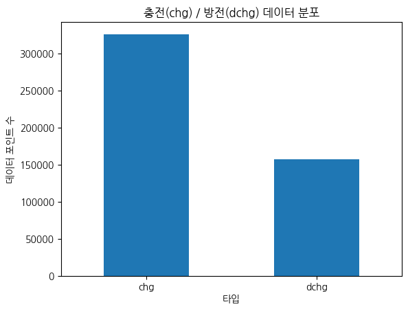
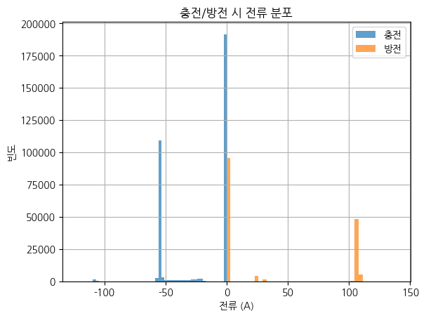
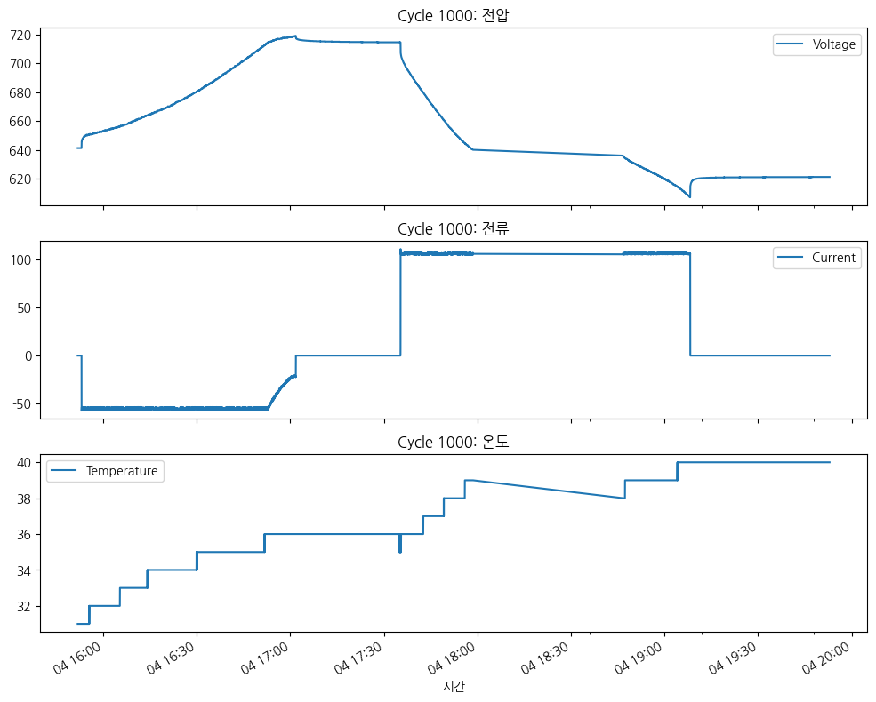
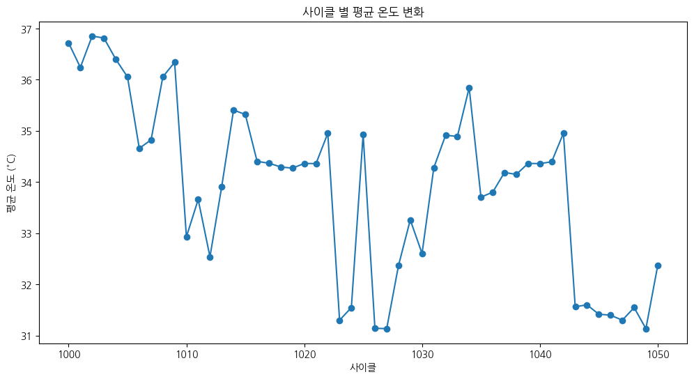
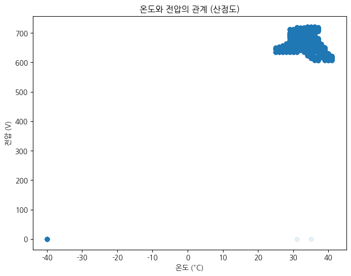

# 배터리 충방전 데이터 EDA 보고서

_이 보고서는 `data/raw_data/train` 폴더의 모든 CSV 파일을 통합하여 생성되었습니다._
## 1. 데이터 개요
### 데이터 샘플 (상위 5개)
```
             DateTime  Voltage  Current  Temperature Cycle Type
0 2020-08-04 15:51:49    641.3      0.0         31.0  1000  chg
1 2020-08-04 15:51:50    641.3      0.0         31.0  1000  chg
2 2020-08-04 15:51:51    641.3      0.0         31.0  1000  chg
3 2020-08-04 15:51:52    641.3      0.0         31.0  1000  chg
4 2020-08-04 15:51:53    641.3      0.0         31.0  1000  chg
```

### 데이터 정보
```
<class 'pandas.core.frame.DataFrame'>
RangeIndex: 482639 entries, 0 to 482638
Data columns (total 6 columns):
 #   Column       Non-Null Count   Dtype         
---  ------       --------------   -----         
 0   DateTime     480948 non-null  datetime64[ns]
 1   Voltage      480949 non-null  float64       
 2   Current      480948 non-null  float64       
 3   Temperature  480948 non-null  float64       
 4   Cycle        482639 non-null  object        
 5   Type         482639 non-null  object        
dtypes: datetime64[ns](1), float64(3), object(2)
memory usage: 22.1+ MB

```

### 기술 통계
```
                            DateTime        Voltage        Current    Temperature
count                         480948  480949.000000  480948.000000  480948.000000
mean   2020-10-29 13:28:50.836844544     683.012654      -2.134577      34.317278
min              2020-08-04 15:51:49       0.000000    -121.500000     -40.000000
25%    2020-08-20 08:58:39.750000128     650.800000     -41.300000      33.000000
50%       2020-09-24 10:46:53.500000     694.800000       0.000000      34.000000
75%    2021-01-12 14:01:34.249999872     712.900000       0.000000      36.000000
max              2021-03-03 13:09:49     721.500000     137.200000      41.000000
std                              NaN      34.559459      45.771913       3.008360
```

### 결측치 확인
```
DateTime       1691
Voltage        1690
Current        1691
Temperature    1691
Cycle             0
Type              0
```

## 2. 데이터 시각화

### 2.1. 충전/방전 데이터 분포
전체 데이터에서 충전과 방전 데이터의 비율을 보여줍니다.


#### 교차표
```
       count
Type        
chg   325834
dchg  156805
```

### 2.2. 전압 분포
충전과 방전 시의 전압 분포를 비교합니다. 충전 시 높은 전압 대역에, 방전 시 낮은 전압 대역에 데이터가 분포하는 경향을 보입니다.


### 2.3. 전류 분포
충전 전류는 양수 값을, 방전 전류는 음수 값을 가집니다. 각 과정에서 특정 전류 값에 데이터가 집중된 것을 볼 수 있습니다.


### 2.4. 온도 분포
측정된 배터리의 평균 온도(Tavg) 분포를 보여줍니다.


### 2.5. 특정 사이클(1000)의 시계열 데이터
첫 번째 사이클(1000)의 시간에 따른 전압, 전류, 온도의 변화를 보여줍니다. 충/방전 과정의 변화 패턴을 확인할 수 있습니다.


### 2.6. 사이클 별 평균 전압
각 사이클의 충전, 방전 과정에서의 평균 전압을 막대 그래프로 비교합니다.


#### 피벗 테이블
```
Type          chg        dchg
Cycle                        
1000   690.951207  634.019392
1001   690.595157  633.925014
1002   691.571621  635.916758
1003   690.729877  635.885110
1004   706.371944  640.303670
```

### 2.7. 사이클 별 평균 온도
사이클이 진행됨에 따른 평균 온도의 변화 추이를 보여줍니다.


### 2.8. 전압-전류 관계
전압과 전류의 관계를 산점도를 통해 확인합니다. 충전/방전 시 특정 구간에 점들이 밀집되어 있습니다.


### 2.9. 온도-전압 관계
온도와 전압의 관계를 산점도를 통해 확인합니다.


### 2.10. 주요 변수 간 상관관계 히트맵
주요 수치형 변수인 전압, 전류, 온도 간의 상관관계를 히트맵으로 시각화합니다. 전류와 전압 사이에 약간의 음의 상관관계가 보입니다.


#### 상관계수 행렬
```
              Voltage   Current  Temperature
Voltage      1.000000 -0.156908    -0.069644
Current     -0.156908  1.000000     0.274998
Temperature -0.069644  0.274998     1.000000
```


# 스트림릿 Streamlit 대시보드 생성 작업지시서

## 목표
`wafer/eda.py` 파일을 기반으로 Streamlit 대시보드를 생성하여 탐색적 데이터 분석(EDA) 결과를 시각화합니다.

## 주요 기능 및 구성
1.  **데이터 로드 및 전처리**:
    *   `wafer/engineering.csv` 파일을 로드하고, `eda.py` 파일에 정의된 전처리 로직을 적용합니다 (결측치 제거, 데이터 타입 변환, 취소 주문 및 0 이하 값 제거, `TotalPrice` 컬럼 생성 등).

2.  **대시보드 레이아웃**:
    *   사용자가 분석 섹션을 쉽게 탐색할 수 있도록 명확하고 직관적인 레이아웃을 구성합니다. (예: 사이드바 메뉴, 탭 또는 확장 가능한 섹션)

3.  **데이터 개요**:
    *   데이터의 기본 정보 (예: `df.head()`, `df.info()`, `df.describe()`)를 표 형태로 표시합니다.

4.  **판매 분석**:
    *   **국가별 주문 수**: 상위 10개 국가별 주문 수를 Plotly 막대 그래프로 시각화합니다.
    *   **월별 총 매출 추이**: 월별 총 매출을 Plotly 선 그래프로 시각화합니다.
    *   **시간대별 주문 수**: 시간대별 주문 수를 Plotly 막대 그래프로 시각화합니다.
    *   **요일별 주문 수**: 요일별 주문 수를 Plotly 막대 그래프로 시각화합니다.

5.  **상품 분석**:
    *   **상위 10개 판매 상품 (수량 기준)**: 가장 많이 판매된 상위 10개 상품을 Plotly 가로 막대 그래프로 시각화합니다.
    *   **상위 10개 매출 상품 (금액 기준)**: 매출액 기준 상위 10개 상품을 Plotly 가로 막대 그래프로 시각화합니다.
    *   **단가와 수량의 관계**: 단가와 수량의 관계를 Plotly 산점도로 시각화합니다. (로그 스케일 적용)

6.  **고객 분석**:
    *   **고객별 총 구매액 분포**: 고객별 총 구매액 분포를 Plotly 히스토그램으로 시각화합니다.
    *   **고객별 주문 빈도 분포**: 고객별 주문 빈도 분포를 Plotly 히스토그램으로 시각화합니다.
    *   **RFM 기반 고객 세그먼트 분포**: `eda.py`의 RFM 분석 로직을 적용하여 고객 세그먼트 분포를 Plotly 가로 막대 그래프로 시각화합니다.

7.  **ARPU 분석**:
    *   **월별 ARPU 추이**: 월별 사용자당 평균 매출(ARPU) 추이를 Plotly 선 그래프로 시각화합니다.
    *   **월별 ARPU**: 월별 ARPU를 Plotly 막대 그래프로 시각화합니다.
    *   월별 ARPU 데이터 (총 매출, 구매 고객 수, ARPU)를 표 형태로 표시합니다.

## 제약 사항
*   **시각화 라이브러리**: 모든 데이터 시각화는 `Plotly` 라이브러리만을 사용하여 구현해야 합니다. `matplotlib` 등 다른 시각화 라이브러리는 사용하지 않습니다.
*   **코드 작성 금지**: 이 작업지시서에는 코드를 직접 작성하지 않습니다. 프롬프트 형태로 기능 명세만 기술합니다.


### **1. 목표**
- `Dataset_battery.csv' 데이터셋을 분석하고 시각화하는 대화형 대시보드를 Streamlit으로 구축합니다.
- `eda.py` 스크립트에서 수행된 분석을 기반으로 하며, 모든 시각화는 **Plotly** 라이브러리를 사용해야 합니다.

### **2. 핵심 기능 요구사항**

#### **가. 데이터 로딩 및 전처리**
- `wafer/Online_Retail.xlsx` 파일을 로드하여 데이터프레임을 생성합니다.
- `eda.py`에서 수행된 것과 동일한 전처리 단계를 적용합니다.
    - `CustomerID`가 없는 행을 제거합니다.
    - 중복된 행을 제거합니다.
    - `CustomerID`를 정수형으로, `InvoiceDate`를 datetime 형식으로 변환합니다.
    - 수량(Quantity)과 단가(UnitPrice)를 곱하여 `TotalPrice` 파생 변수를 생성합니다.

#### **나. 대시보드 레이아웃**
- Streamlit의 사이드바(`st.sidebar`)를 사용하여 각 분석 페이지로 이동할 수 있는 메뉴를 구성합니다.
- 메뉴는 "메인", "매출 분석", "고객 및 상품 분석", "사용자 행동 분석" 등의 섹션으로 구분합니다.
- 각 페이지 내에서는 `st.tabs`를 사용하여 관련 시각화 및 정보를 논리적으로 그룹화하고 분리하여 표시합니다.

#### **다. 시각화 (Plotly 사용)**
- 모든 차트는 `plotly.express` 또는 `plotly.graph_objects`를 사용하여 생성합니다. **(Matplotlib, Seaborn 사용 금지)**
- 각 시각화 아래에는 `st.dataframe`이나 `st.expander`를 사용하여 관련 데이터를 표 형태로 표시합니다.
- `eda.py`의 모든 분석 결과를 아래와 같이 Plotly 차트로 구현합니다.
    1.  **월별 총 매출**: 라인 차트
    2.  **상위 10개국 매출**: 막대 차트
    3.  **상위 10개 상품 판매량**: 수평 막대 차트
    4.  **시간대별/요일별 주문 건수**: 막대 차트
    5.  **상위 10명 고객 구매액**: 막대 차트
    6.  **월별 ARPU(가입자당 평균 매출)**: 라인 차트와 막대 차트
    7.  **평균 DAU vs MAU**: 막대 차트
    8.  **시간-요일별 주문 히트맵**: `plotly.graph_objects.Heatmap` 사용
    9.  **월단위 고객 리텐션**: `plotly.graph_objects.Heatmap` 사용. 첫 번째 열의 이름은 'Acquisition'으로 지정합니다.

#### **라. 상호작용 기능**
- 사이드바에 연도 또는 국가를 선택할 수 있는 필터(`st.selectbox` 등)를 추가하여 일부 차트의 데이터를 동적으로 필터링할 수 있는 기능을 구현합니다.
- 예를 들어, 사용자가 특정 국가를 선택하면 해당 국가의 매출 데이터만 시각화에 반영되도록 합니다.
- **데이터 검색 기능**: 사용자가 데이터프레임(`df`) 내의 `Description` 또는 `InvoiceNo` 열에서 특정 키워드를 검색하여 관련 데이터를 필터링하고 표시할 수 있도록 `st.text_input` 위젯과 함께 검색 기능을 구현합니다. 검색 결과는 별도의 테이블로 표시합니다.

### **3. 코드 및 개발 환경**
- 최종 결과물은 `wafer/dashboard.py` 라는 단일 파일로 작성합니다.
- 모든 차트의 제목, 축 레이블, 범례 등은 한글로 명확하게 표시합니다.
- 코드에는 각 기능과 로직을 설명하는 한글 주석을 포함합니다.
- `streamlit run wafer/dashboard.py` 명령어로 실행 가능해야 합니다.