# Wafer 데이터 탐색적 데이터 분석(EDA) 보고서

분석 일자: 2025-12-06

## 1. 데이터 기본 정보

- **총 행 수**: 811,457

- **총 컬럼 수**: 6

- **메모리 사용량**: 628.94 MB

### 데이터 샘플 (상위 10개)

|    |   dieSize | lotName   |   waferIndex | trianTestLabel   | failureType   |
|---:|----------:|:----------|-------------:|:-----------------|:--------------|
|  0 |      1683 | lot1      |            1 | [['Training']]   | [['none']]    |
|  1 |      1683 | lot1      |            2 | [['Training']]   | [['none']]    |
|  2 |      1683 | lot1      |            3 | [['Training']]   | [['none']]    |
|  3 |      1683 | lot1      |            4 | [['Training']]   | [['none']]    |
|  4 |      1683 | lot1      |            5 | [['Training']]   | [['none']]    |
|  5 |      1683 | lot1      |            6 | [['Training']]   | [['none']]    |
|  6 |      1683 | lot1      |            7 | [['Training']]   | [['none']]    |
|  7 |      1683 | lot1      |            8 | [['Training']]   | [['none']]    |
|  8 |      1683 | lot1      |            9 | [['Training']]   | [['none']]    |
|  9 |      1683 | lot1      |           10 | [['Training']]   | [['none']]    |

## 2. 컬럼 정보

### 컬럼별 상세 정보

|    | 컬럼명         | 데이터타입   |   결측값 |   결측비율(%) |
|---:|:---------------|:-------------|---------:|--------------:|
|  0 | waferMap       | object       |        0 |             0 |
|  1 | dieSize        | float64      |        0 |             0 |
|  2 | lotName        | object       |        0 |             0 |
|  3 | waferIndex     | float64      |        0 |             0 |
|  4 | trianTestLabel | object       |        0 |             0 |
|  5 | failureType    | object       |        0 |             0 |

## 3. 수치형 변수 통계

### 기술 통계량

|       |   dieSize |   waferIndex |
|:------|----------:|-------------:|
| count | 811457    | 811457       |
| mean  |   1841    |     12.9612  |
| std   |   2254.99 |      7.20749 |
| min   |      3    |      1       |
| 25%   |    710    |      7       |
| 50%   |    953    |     13       |
| 75%   |   1902    |     19       |
| max   |  48099    |     25       |

## 4. 데이터 분포 시각화

### Die Size 분포 및 박스플롯

Die Size의 평균은 1841.00, 중앙값은 953.00입니다.

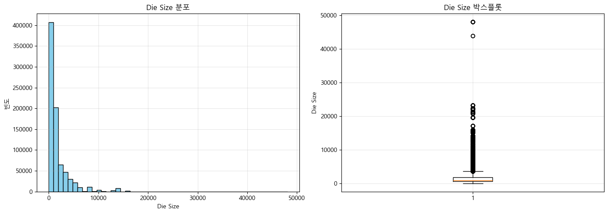

### Wafer Index 분포

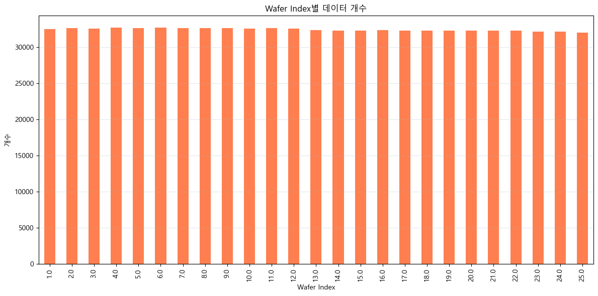

### Wafer Index별 개수

|   waferIndex |   개수 |
|-------------:|-------:|
|            1 |  32516 |
|            2 |  32663 |
|            3 |  32621 |
|            4 |  32714 |
|            5 |  32701 |
|            6 |  32745 |
|            7 |  32672 |
|            8 |  32650 |
|            9 |  32636 |
|           10 |  32586 |
|           11 |  32637 |
|           12 |  32598 |
|           13 |  32381 |
|           14 |  32353 |
|           15 |  32301 |
|           16 |  32362 |
|           17 |  32333 |
|           18 |  32333 |
|           19 |  32285 |
|           20 |  32290 |
|           21 |  32320 |
|           22 |  32312 |
|           23 |  32202 |
|           24 |  32197 |
|           25 |  32049 |

## 5. Lot Name 분석

### 상위 20개 Lot 분포

총 46,293개의 고유 Lot이 있습니다.

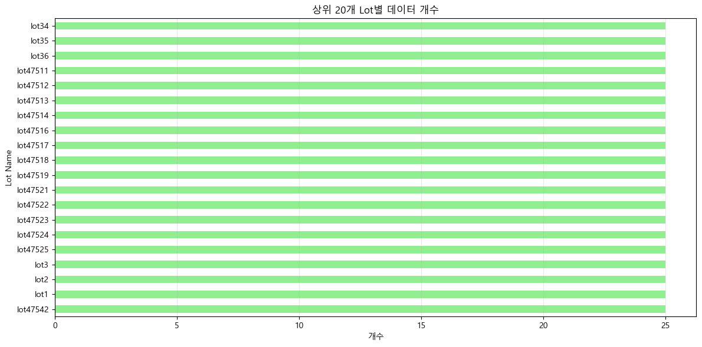

### 상위 20개 Lot별 개수

| lotName   |   개수 |
|:----------|-------:|
| lot47542  |     25 |
| lot1      |     25 |
| lot2      |     25 |
| lot3      |     25 |
| lot47525  |     25 |
| lot47524  |     25 |
| lot47523  |     25 |
| lot47522  |     25 |
| lot47521  |     25 |
| lot47519  |     25 |
| lot47518  |     25 |
| lot47517  |     25 |
| lot47516  |     25 |
| lot47514  |     25 |
| lot47513  |     25 |
| lot47512  |     25 |
| lot47511  |     25 |
| lot36     |     25 |
| lot35     |     25 |
| lot34     |     25 |

## 6. Train/Test Label 분석

### Train/Test Label 분포

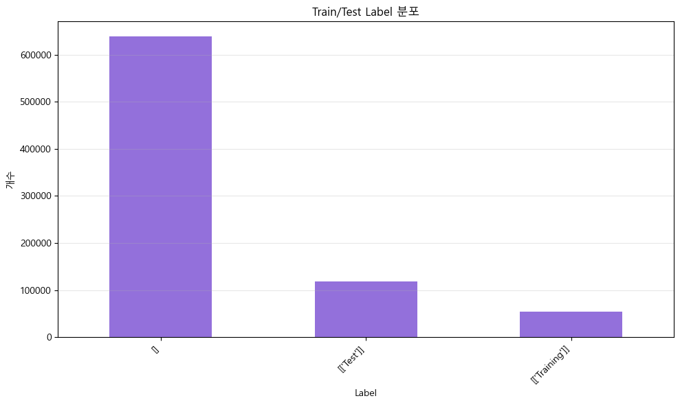

### Label별 개수

| label_str      |   개수 |
|:---------------|-------:|
| []             | 638507 |
| [['Test']]     | 118595 |
| [['Training']] |  54355 |

## 7. Failure Type 분석

### 상위 15개 Failure Type 분포

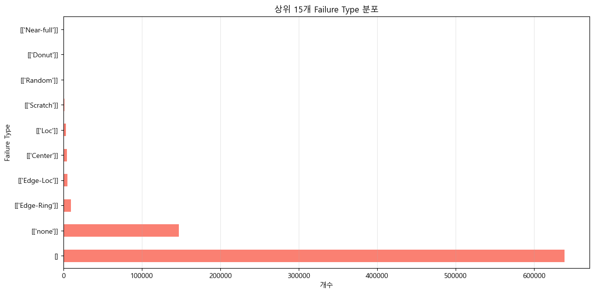

### Failure Type별 개수 (상위 20개)

| failure_str     |   개수 |
|:----------------|-------:|
| []              | 638507 |
| [['none']]      | 147431 |
| [['Edge-Ring']] |   9680 |
| [['Edge-Loc']]  |   5189 |
| [['Center']]    |   4294 |
| [['Loc']]       |   3593 |
| [['Scratch']]   |   1193 |
| [['Random']]    |    866 |
| [['Donut']]     |    555 |
| [['Near-full']] |    149 |

## 8. Wafer Map 형태 분석

### Wafer Map 크기 분포

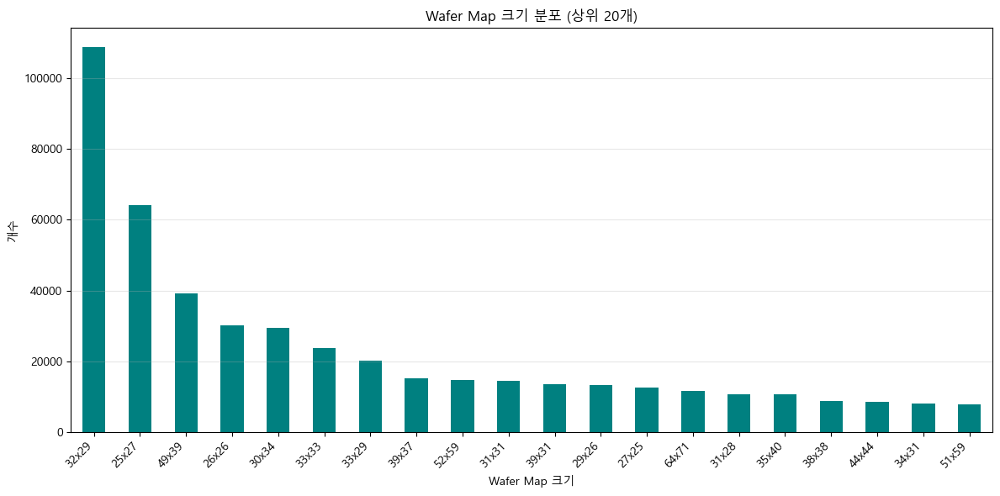

### Wafer Map 크기별 개수 (상위 20개)

| waferMap   |   개수 |
|:-----------|-------:|
| 32x29      | 108687 |
| 25x27      |  64083 |
| 49x39      |  39323 |
| 26x26      |  30078 |
| 30x34      |  29513 |
| 33x33      |  23886 |
| 33x29      |  20276 |
| 39x37      |  15327 |
| 52x59      |  14812 |
| 31x31      |  14569 |
| 39x31      |  13562 |
| 29x26      |  13247 |
| 27x25      |  12655 |
| 64x71      |  11692 |
| 31x28      |  10788 |
| 35x40      |  10676 |
| 38x38      |   8895 |
| 44x44      |   8601 |
| 34x31      |   8155 |
| 51x59      |   7890 |

## 9. 샘플 Wafer Map 시각화

### 샘플 Wafer Map (Index: 0)

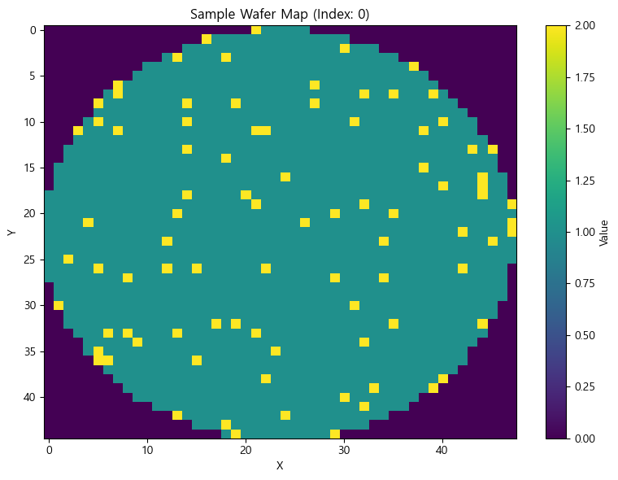

### 샘플 Wafer Map (Index: 100)

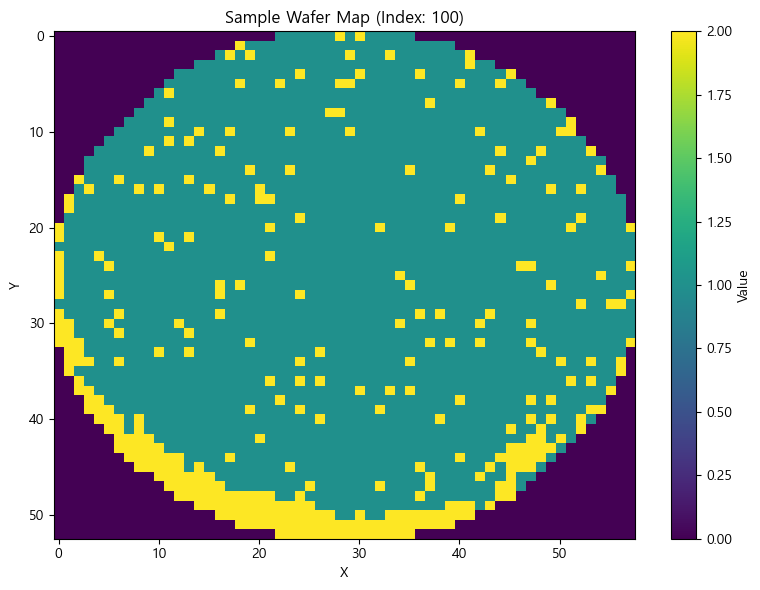

### 샘플 Wafer Map (Index: 1000)

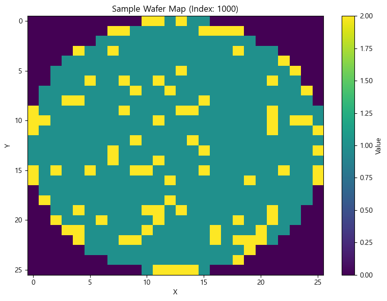

### 샘플 Wafer Map (Index: 5000)

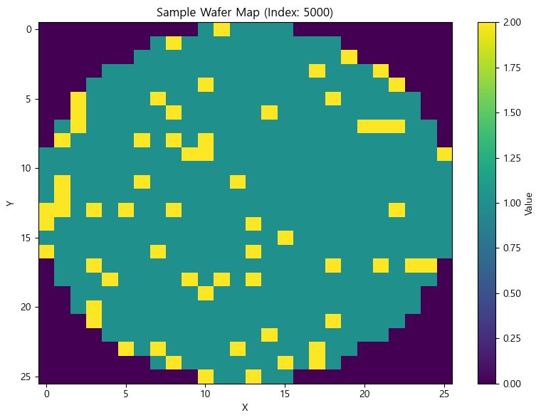

### 샘플 Wafer Map (Index: 10000)

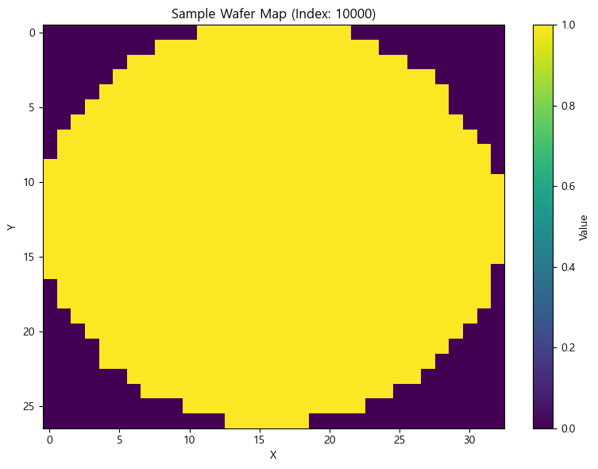

## 10. Die Size와 Wafer Index 관계

### Die Size와 Wafer Index 산점도

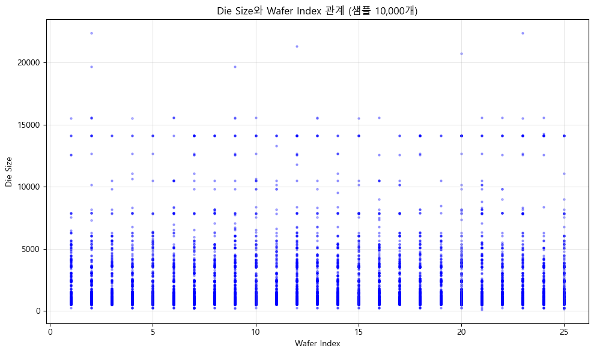

### 수치형 변수 상관계수

|            |     dieSize |   waferIndex |
|:-----------|------------:|-------------:|
| dieSize    |  1          |  -0.00072488 |
| waferIndex | -0.00072488 |   1          |

## 11. 주요 발견 및 인사이트

### 데이터 특성

- 총 811,457개의 웨이퍼 데이터가 포함되어 있습니다.

- 46,293개의 고유한 Lot이 존재합니다.

- 각 Lot당 평균 17.53개의 웨이퍼가 있습니다.

- Wafer Index는 1부터 25까지 분포합니다.

### Die Size 분석

- Die Size 범위: 3 ~ 48099

- 평균: 1841.00, 중앙값: 953.00

- 표준편차: 2254.99 (분산이 큼)

### Wafer Map 특성

- 가장 일반적인 Wafer Map 크기: 32x29

- Wafer Map은 2D 배열로 저장되어 있으며, 각 셀은 해당 위치의 다이 상태를 나타냅니다.

### Label 분포

- Train/Test Label의 고유값 개수: 3

- Failure Type의 고유값 개수: 10

### 상관관계

- dieSize와 waferIndex 간 상관계수: -0.001
