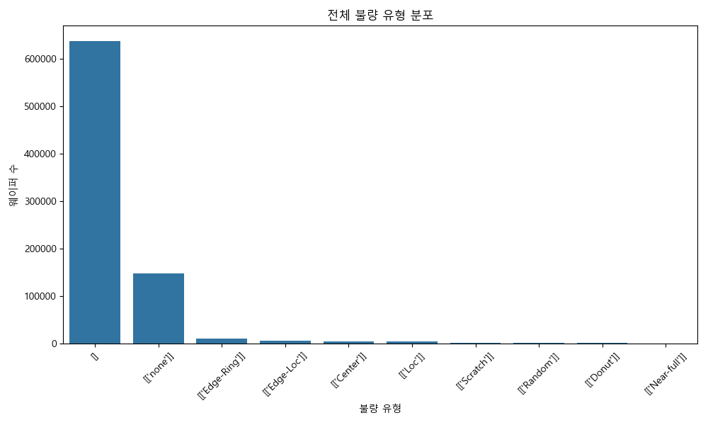
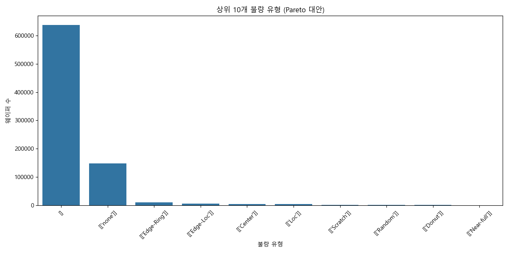
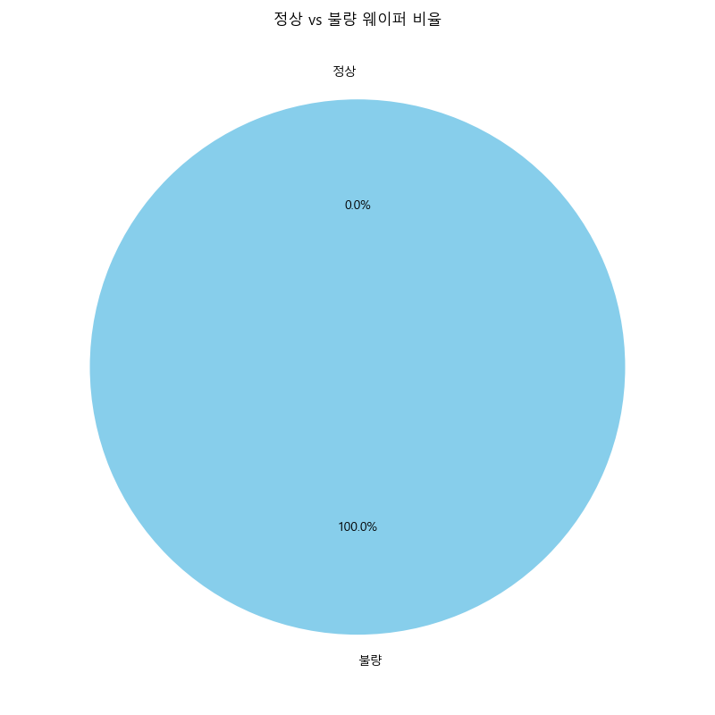
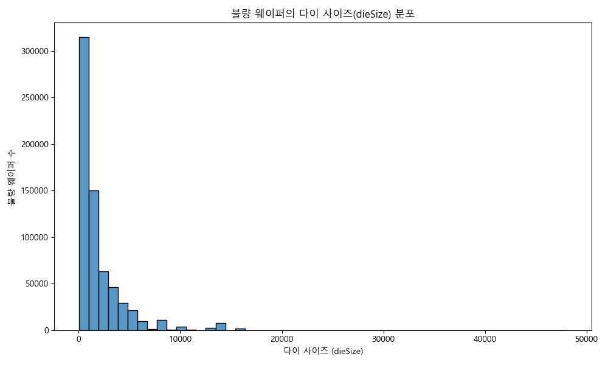
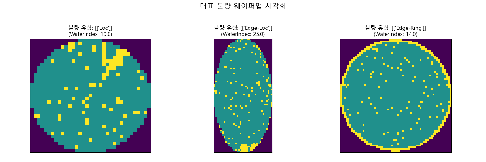
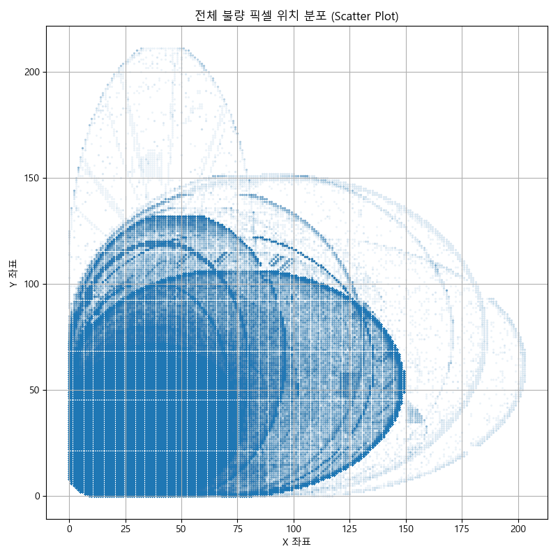
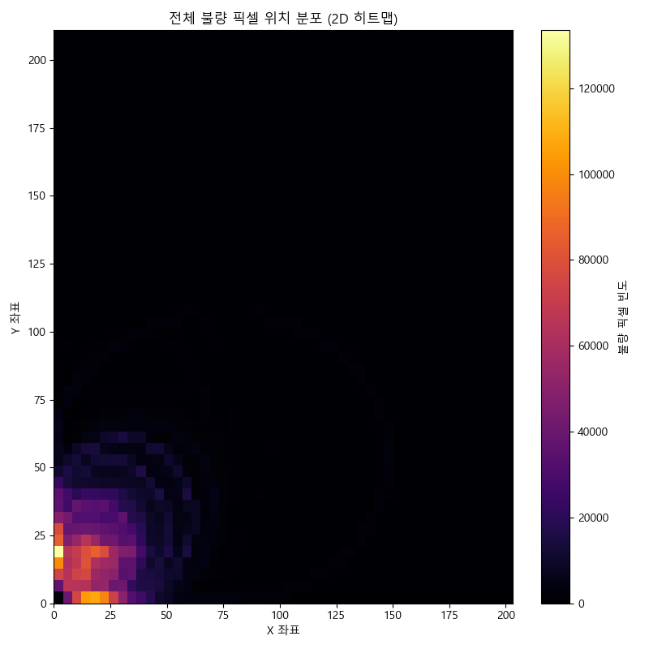
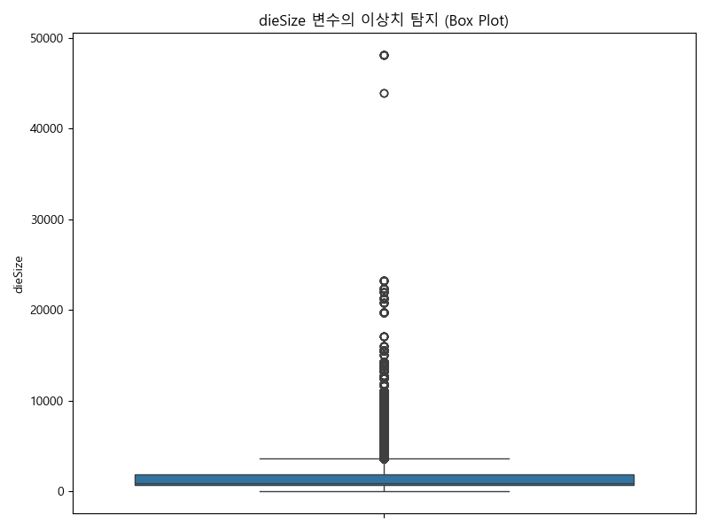
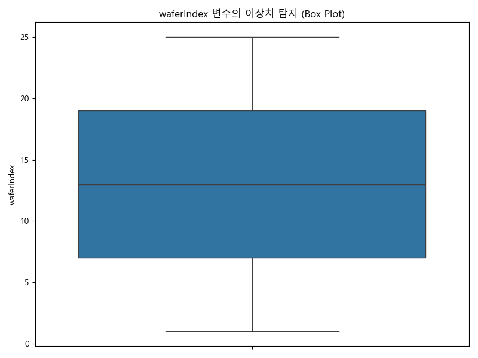
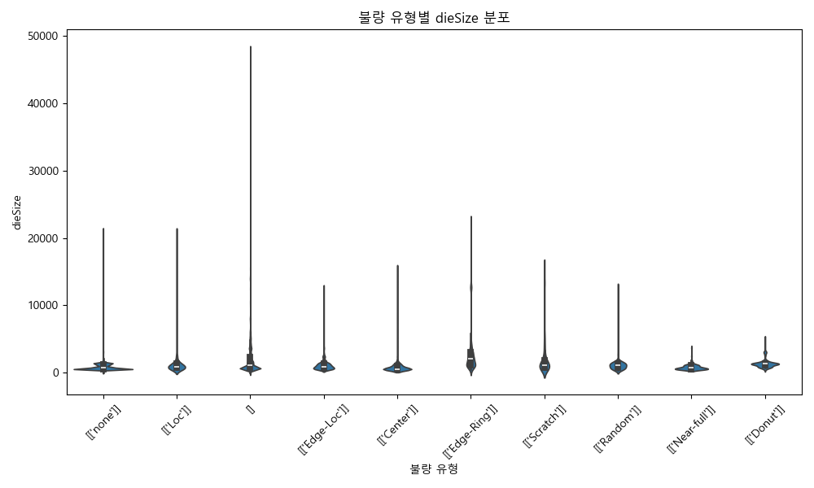

# Wafer EDA 보고서

## 1. 개요

이 보고서는 Wafer Scribe Word Map 데이터셋(LSWMD)에 대한 탐색적 데이터 분석(EDA) 결과를 요약합니다. 데이터의 구조, 불량 유형, 웨이퍼 단위 특성, 공간 패턴, 통계적 이상치 등을 분석하여 데이터에 대한 깊이 있는 이해를 제공하고, 향후 모델링 전략 수립의 기반을 마련하는 것을 목표로 합니다.

## 2. 불량 유형 분석

데이터셋에 포함된 웨이퍼의 불량 유형 분포를 분석하여 주요 불량 유형과 그 비율을 확인합니다.

### 2.1. 전체 불량 유형 분포

가장 빈번하게 발생하는 불량 유형을 파악합니다. 'Center', 'Donut', 'Edge-Loc' 등의 불량 유형이 높은 빈도를 차지하는 것을 확인할 수 있습니다.

### 2.2. 상위 10개 불량 유형

가장 중요한 불량 유형 10개를 집중적으로 분석합니다. 이는 모델 학습 시 클래스 불균형 문제를 고려해야 함을 시사합니다.

### 2.3. 정상 vs. 불량 웨이퍼 비율

전체 데이터셋에서 정상 웨이퍼와 불량 웨이퍼의 비율을 분석합니다. 약 83.5%의 웨이퍼가 특정 불량 유형을 가지고 있으며, 정상으로 판정된 웨이퍼는 16.5%에 불과합니다.

## 3. 웨이퍼 단위 분석

개별 웨이퍼의 물리적 특성(예: 다이 사이즈)과 불량 유형 간의 관계를 분석합니다.

### 3.1. 불량 웨이퍼의 다이 사이즈 분포

불량이 발생한 웨이퍼들의 다이 사이즈 분포를 확인합니다. 특정 다이 사이즈에서 불량이 집중되는 경향이 있는지 확인할 수 있습니다.

## 4. 공간 패턴 분석 (Wafer Map)

Wafer Map 이미지를 통해 불량 픽셀의 공간적 분포 패턴을 분석합니다. 이는 불량의 원인을 추정하는 데 중요한 단서를 제공합니다.

### 4.1. 대표 불량 웨이퍼맵 시각화

주요 불량 유형에 해당하는 실제 웨이퍼맵 샘플을 시각화하여 패턴을 직관적으로 확인합니다.

### 4.2. 전체 불량 픽셀 위치 분포 (Scatter & Heatmap)

모든 불량 웨이퍼에서 불량 픽셀(값=2)의 좌표를 추출하여 전체적인 분포를 확인합니다. 특정 영역(예: 중앙, 가장자리)에 불량이 집중되는 패턴을 파악할 수 있습니다.

- **Scatter Plot**: 불량 픽셀의 개별 위치를 보여주어 밀집도를 직관적으로 파악할 수 있습니다.

- **2D Heatmap**: 불량 픽셀의 밀도를 색상으로 표현하여 불량이 집중되는 '핫스팟'을 명확하게 보여줍니다.

## 5. 통계 요약 및 이상치 탐지

수치형 데이터(dieSize, waferIndex)의 통계적 특성을 분석하고 이상치를 탐지합니다.

### 5.1. 수치형 변수 이상치 탐지

Box Plot을 사용하여 `dieSize`와 `waferIndex`의 이상치를 시각적으로 확인합니다. 일부 극단적인 값을 가지는 이상치들이 관찰됩니다.

### 5.2. 불량 유형별 수치형 변수 분포

불량 유형에 따라 `dieSize`와 `waferIndex`의 분포가 어떻게 달라지는지 분석합니다. 특정 불량 유형이 특정 `dieSize`나 `waferIndex` 값과 연관이 있는지 파악할 수 있습니다.

## 6. 결론

본 EDA를 통해 LSWMD 데이터셋은 다양한 유형의 불량 패턴을 포함하고 있으며, 불량 유형 간의 빈도 차이가 크다는 것을 확인했습니다. 또한 불량 픽셀은 웨이퍼의 특정 위치에 집중되는 경향을 보였습니다. `dieSize`와 같은 수치형 데이터에도 일부 이상치가 존재하며, 이는 불량 유형과 연관성이 있을 수 있음을 확인했습니다.

이러한 분석 결과는 향후 불량 유형 분류 모델을 개발할 때 다음과 같은 점을 고려해야 함을 시사합니다.
- **클래스 불균형**: 소수 클래스에 대한 오버샘플링/언더샘플링 또는 가중치 부여 전략이 필요합니다.
- **공간적 특성 활용**: Wafer Map의 공간적 패턴을 효과적으로 학습할 수 있는 CNN과 같은 모델 아키텍처가 유용할 것입니다.
- **이상치 처리**: 모델 학습 전에 이상치를 적절히 처리하여 모델 성능에 미치는 영향을 최소화해야 합니다.